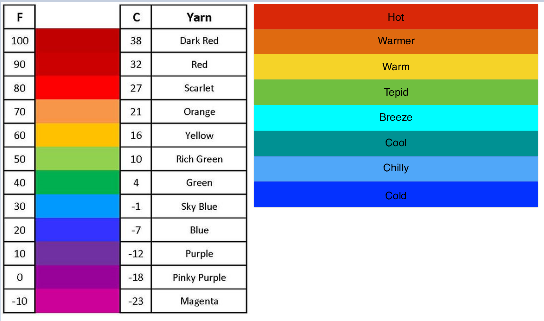

# influxdb-challenge

Participation in InfluxDB Challenge in 2022, September

More informations in https://www.influxdata.com/influxdb-challenge/

### About Data

Hourly Climate data from São Paulo during 2021, March

(Obs: The year-month was changed to 2022-September because Buckets in Cloud retain 30 days - see ETL.ipynb)

Dataset ([Climate Weather Surface of Brazil - Hourly | Kaggle](https://www.kaggle.com/datasets/PROPPG-PPG/hourly-weather-surface-brazil-southeast-region))

### Tasks

- [x] Sign up for InfluxDB Cloud
- [x] Load data into the platform (ETL.ipynb)
- [x] Create a task in the platform (print_task.png)
- [x] Create a dashboard to visualize the data (print_dashboard.png)
- [x] Transform your data for extra credit (print_transform.png)
- [x] Submit your challenge
- [x] Receive Gifts (sock.jpeg)

### Additional Informations

Automatic Stations Catalog ([Instituto Nacional de Meteorologia - INMET](https://portal.inmet.gov.br/paginas/catalogoaut#))

| COD  | NOME       | LATITUDE   | LONGITUDE  | ALTITUDE |
| ---- | ---------- | ---------- | ---------- | -------- |
| A708 | FRANCA     | -20,584444 | -47,382500 | 1002,74  |
| A718 | RANCHARIA  | -22,372778 | -50,974722 | 398,75   |
| A747 | PRADOPOLIS | -21,338333 | -48,113889 | 540,41   |
| A753 | ITUVERAVA  | -20,359722 | -47,775278 | 610,58   |
| A766 | REGISTRO   | -24,533056 | -47,864167 | 35,00    |

Scale reference



### To review

It was my first time working with InfluxDB, so I guess maybe there is a better way too ingest data than doing a for loop in a dict to write Point by Point.

Update: Probable Solution is Using sequence

```
sequence = ["mem,host=host1 used_percent=23.43234543",
            "mem,host=host1 available_percent=15.856523"]
write_api.write(bucket, org, sequence)
```
